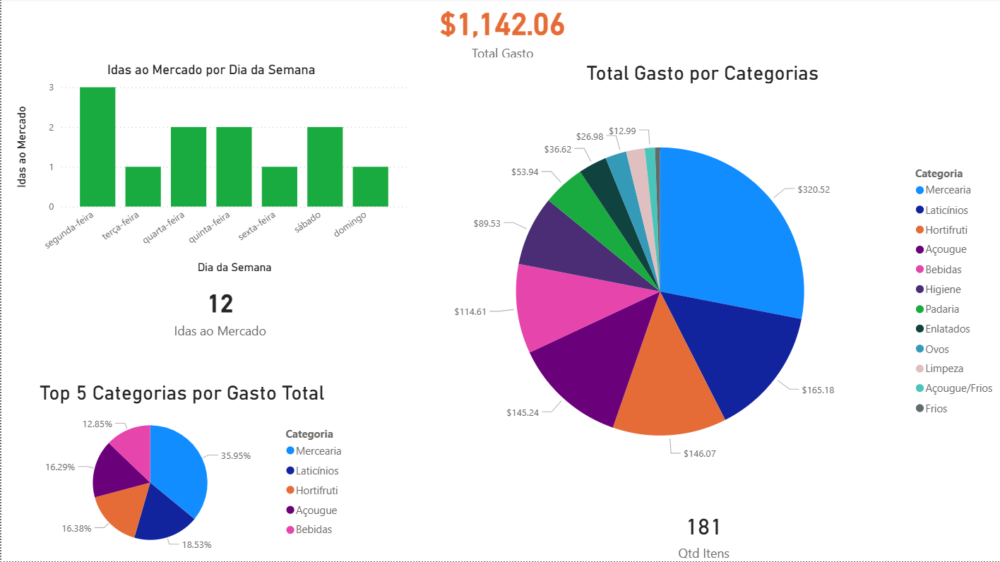

# 🛒 Dashboard de Compras e Hábitos de Consumo

> Este projeto nasceu da necessidade de transformar dados brutos de consumo doméstico em insights acionáveis para gestão financeira e economia pessoal. Utilizando Power BI, desenvolvi uma solução que monitora a variação de preços e o volume de compras, permitindo uma visão estratégica sobre o custo de vida.

---

## 🔍 Insights e Perguntas de Negócio Respondidas

> **1. Onde está concentrado o meu maior volume de consumo?**
> * **Insight:** Aplicação da **Curva de Pareto (80/20)**. Identifiquei que apenas 4 SKUs (**Pão, Tomate, Cebola e Banana**) representam a grande maioria do volume total de compras, permitindo focar a estratégia de economia nesses itens de alto giro.

> **2. Existe um padrão de comportamento nos dias da semana?**
> * **Insight:** **Análise de Sazonalidade**. O dashboard revelou um padrão de compras recorrentes às segundas-feiras para o abastecimento de itens frescos e de consumo imediato (Cebola, Tomate e Pão), indicando a necessidade de um estoque semanal curto.

> **3. Qual é a minha eficiência de planejamento?**
> * **Insight:** **Otimização de Fluxo**. Através da métrica de frequência (**DISTINCTCOUNT**), identifiquei a oportunidade de centralizar compras de alto valor agregado (como Carnes) às sextas-feiras, aproveitando janelas de promoções e reduzindo o custo médio por visita.

> **4. Quais são os drivers de inflação interna?**
> * **Insight:** **Gestão de Categorias**. A variação de preços em Hortifrúti sugere que a antecipação das compras para quartas e quintas-feiras (dias de ofertas setorizadas) é o principal driver para mitigar a inflação interna.

---

## 🚀 Desafios e Soluções Técnicas

O maior desafio deste projeto não foi a visualização, mas o tratamento de dados (**ETL**) de uma base heterogênea. Abaixo, as principais implementações:

### 🛠️ Power Query (ETL & Data Cleaning)
* **Normalização de Dados:** Implementação de lógica condicional para agrupar SKUs variados em categorias limpas (ex: "Pão", "Achocolatados", "Hortifrúti").
* **Padronização de Unidades:** Tratamento de inconsistências entre itens vendidos por **Unidade (UN)** e **Peso (KG)**, garantindo uma análise de volume matematicamente precisa.
* **Data Cleaning:** Ajuste de tipos de dados, máscaras de data e tratamento de separadores decimais para compatibilidade total entre Excel e Power BI.

### 📊 DAX & Modelagem (Business Intelligence)
* **Ranking Dinâmico:** Criação de medidas de ranking para destacar automaticamente os itens de maior consumo (**Top 5**).
* **Lógica de Ordenação Personalizada:** Desenvolvimento de uma métrica de bônus via DAX para priorizar visualmente itens de peso (KG) no topo do gráfico.
* **Métricas de Frequência:** Uso de `DISTINCTCOUNT` para monitorar o volume de idas ao mercado e analisar a periodicidade do abastecimento.
* **Cálculo de Variação Temporal:** Gráficos de séries temporais para acompanhar a volatilidade de preços ao longo do mês.

---

## 📈 Visualizações de Destaque
* **Análise de Pareto/Volume:** Identificação clara de quais produtos representam 80% do volume de compras.
* **Formatação Condicional:** Uso de cores estratégicas para guiar o olhar do usuário para insights de preço e categoria.
* **Filtros Dinâmicos:** Segmentação por dia da semana e categoria de produto para análises granulares.

---

## 🛠️ Tecnologias Utilizadas
* **Microsoft Power BI** (Desktop & Service)
* **DAX** (Data Analysis Expressions)
* **Power Query** (M Language)
* **Excel** (Data Source)

---

## 👩‍💻 Sobre a Autora
Desenvolvido por **Viviane Leite da Silva**.  
Analista em transição para a área de Dados, com foco em transformar informações em decisões.