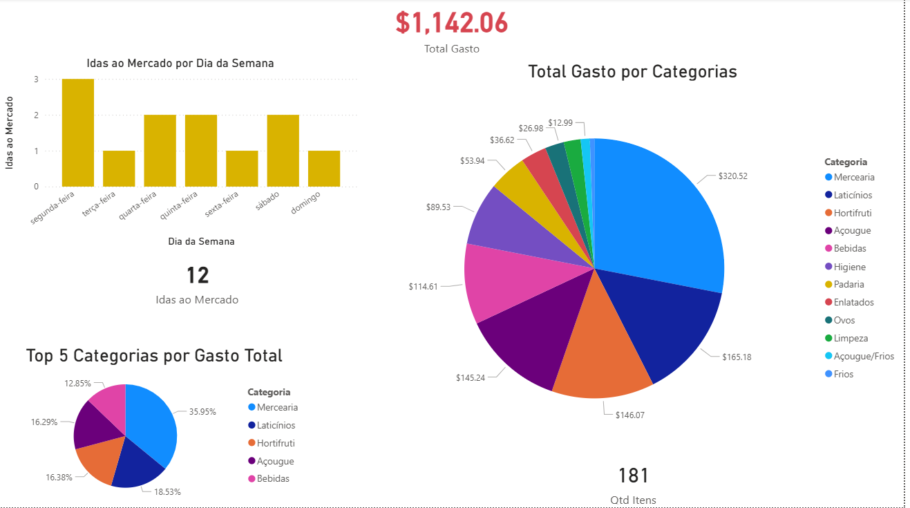

🛒 Dashboard de Inteligência de Compras e Hábitos de Consumo

Este projeto nasceu da necessidade de transformar dados brutos de consumo doméstico em insights acionáveis para gestão financeira e economia pessoal. Utilizando Power BI, desenvolvi uma solução que monitora a variação de preços e o volume de compras, permitindo uma visão estratégica sobre o custo de vida.

🚀 Desafios e Soluções Técnicas
O maior desafio deste projeto não foi a visualização, mas o tratamento de dados (ETL) de uma base heterogênea. Abaixo, destaco as principais implementações:

🛠️ Power Query (ETL & Data Cleaning)
Normalização de Dados: Implementação de lógica condicional para agrupar SKUs variados em categorias limpas (ex: "Pão", "Achocolatados", "Hortifrúti").

Padronização de Unidades: Tratamento de inconsistências entre itens vendidos por Unidade (UN) e Peso (KG), garantindo que a análise de volume fosse matematicamente precisa.

Data Cleaning: Ajuste de tipos de dados, máscaras de data e tratamento de separadores decimais para compatibilidade total entre Excel e Power BI.

📊 DAX & Modelagem (Business Intelligence)
Ranking Dinâmico: Criação de medidas de ranking para destacar automaticamente os itens de maior consumo (Top 5).

Lógica de Ordenação Personalizada: Desenvolvimento de uma métrica de bônus via DAX para priorizar visualmente itens de peso (KG) no topo do gráfico, separando-os de itens por unidade.

Métricas de Frequência: Uso de DISTINCTCOUNT para monitorar o volume de idas ao mercado, permitindo analisar a periodicidade do abastecimento doméstico.

Cálculo de Variação Temporal: Gráficos de séries temporais para acompanhar a volatilidade de preços de produtos específicos ao longo do mês.

📈 Visualizações de Destaque
Análise de Pareto/Volume: Identificação clara de quais produtos representam 80% do volume de compras.

Formatação Condicional: Uso de cores estratégicas para guiar o olhar do usuário para insights de preço e categoria.

Filtros Dinâmicos: Segmentação por dia da semana e categoria de produto para análises granulares.

🛠️ Tecnologias Utilizadas
Microsoft Power BI (Desktop & Service)

DAX (Data Analysis Expressions)

Power Query (M Language)

Excel (Data Source)